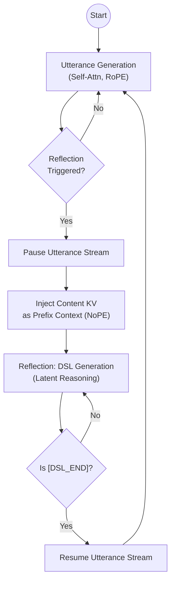

# Project MASA: Manifold-Aligned Sparse Attention

**Engineering Design Document v2.0 (Dual-Track LoRA Architecture)**

- **Date:** 2026-02-13
- **Status:** Detailed Design / Implementation Ready
- **Core Philosophy:** Dual-Track Latent Reasoning — a mutable thought stream that runs alongside an immutable utterance stream, enabling the model to actively construct, revise, and compose its own semantic memory.

## 1. Vision & Research Roadmap

> **What this project is NOT:** MASA is not an attempt to extend context windows or to compete with brute-force long-context architectures. Models with million-token windows already exist; making the context longer is a solved engineering problem. What remains unsolved is giving a model the ability to *think about* what it has experienced — to actively judge relevance, build cross-temporal connections, revise outdated beliefs, and reason over a structured internal representation of its own history.

This project designs a **latent reasoning track** that runs in parallel with the model's ordinary text generation. The text a model has already emitted is immutable — tokens, once spoken, cannot be unsaid. But the *ideas* those tokens rest upon can and should evolve. The DSL stream is where that evolution happens: a mutable, stack-managed thought substrate in which the model constructs, updates, and discards semantic memory nodes as its understanding develops.

We propose a progressive curriculum: start with an explicit symbolic scaffold (readable text summaries), compress it into learned latent representations, and ultimately arrive at a compositional codebook — the "morphemes of thought."

### 1.1 The Core Hypothesis
An internalized "Thought & Memory Agent" (implemented via Dual-Track LoRA) can develop structured reasoning capabilities that neither brute-force long context nor external retrieval can provide, by learning to:
1.  **Actively Construct:** Decide *when* a piece of content is worth crystallizing into a memory node, and generate that node in real time (DSL Activation as a deliberate cognitive act).
2.  **Establish Explicit Connections:** Build cross-temporal semantic links (RECALL, UPDATE, CONFLICT) that form an evolving graph of ideas — not merely a flat retrieval index, but a relational structure over the model's own history.
3.  **Revise and Forget:** Modify or discard memory nodes as understanding changes. The DSL stream is mutable by design — it is a *working memory*, not an append-only log.
4.  **Reason in Latent Space:** As the DSL evolves from text summaries (Stage A) to learned embeddings (Stage B) to compositional codes (Stage C), DSL generation itself becomes a form of latent reasoning — the model "thinks" in a compressed, non-verbal representation before deciding how to attend.

### 1.2 The Three-Stage Evolution

We do not aim to build the final system in one shot. The DSL begins as a human-readable scaffold and progressively internalizes into a true latent reasoning medium.

#### Stage A: The Scaffold (Symbolic & Explicit)
-   **Goal:** Validate the "Active Activation" mechanism — prove that the model can learn *when* and *why* to pause and reflect.
-   **Method:**
    -   **DSL Content:** Explicit text summaries generated by an Oracle (e.g., GPT-4o).
    -   **Mechanism:** The model learns *when* to trigger `[DSL_START]` and *how* to attend to these text summaries via NoPE cross-attention.
    -   **Value:** Fully interpretable, easy to debug. Establishes that a model can develop active memory management as a learned behavior, not a hard-coded heuristic.

#### Stage B: The Compression (Latent & Mutable)
-   **Goal:** (1) Transition the thought stream from text to latent space — DSL generation becomes non-verbal reasoning. (2) Enable mutable memory — introduce stack operations so the model can revise its own beliefs.
-   **Method:**
    -   **DSL Content:** Distill text summaries into **Query Tokens** (Learned Embeddings).
    -   **Mechanism:** Each activation point is associated with a specific, learned embedding vector. The model now "thinks" in latent codes rather than natural language.
    -   **Mutability:** Introduce `[PUSH]`, `[POP]`, `[UPDATE]` operations on the DSL KV buffer. Spoken words are immutable, but the thought nodes they are grounded in can be revised or discarded as the model's understanding evolves. This is the key architectural distinction: **the content stream is an append-only log; the DSL stream is a working memory.**
    -   **Value:** Validates that latent reasoning can maintain (or exceed) recall quality while providing true belief revision — something no flat context window can offer.

#### Stage C: The Abstraction (Vocabulary & Compositional)
-   **Goal:** Achieve compositional generalization — the model learns a finite set of "thought primitives" that combine to express open-ended concepts.
-   **Method:**
    -   **DSL Content:** Compositional codes from a fixed, abstract **Codebook**.
    -   **Mechanism:** "Peanut Allergy" is not a unique ID, but a combination of `[FOOD] + [RISK] + [USER_ATTR]`. The model has learned the "morphemes of thought."
    -   **Value:** True generalization with finite vocabulary. A new concept never seen in training can be expressed as a novel composition of existing codes — analogous to how humans form new ideas from familiar building blocks.
    -   **Strategy:** We do not enforce this initially. We observe if Stage B's embeddings naturally cluster, then induce quantization/codebook formation via contrastive loss.

---

## 2. System Architecture Overview

The system implements a Dual-Track architecture where a single Foundation Model backbone is shared between two logical streams: an immutable **Content** stream (what has been said) and a mutable **DSL** stream (what the model currently thinks about what has been said).

### 2.1 The Two Tracks

**Track A: Content Stream (The "Utterance")**
- **Role:** Surface-level text generation. This is the model's public output — once generated, immutable.
- **Parameters:** Frozen Base + LoRA_Content (optional/minimal).
- **KV Cache:** `content_kv` (Append-only, paged, sparsely loaded on demand).
- **Positional Encoding:** Standard continuous RoPE.

**Track B: DSL Stream (The "Thought")**
- **Role:** Latent reasoning, semantic connection-building, mutable belief management. This track is where the model reflects on content, establishes cross-temporal links, and revises its internal state.
- **Parameters:** Frozen Base + LoRA_DSL (Specialized for structured reasoning).
- **KV Cache:** `dsl_kv` (Compact, mutable, always resident — the model's working memory).
- **Positional Encoding:** Independent RoPE for self-attention; NoPE (No Positional Encoding) for cross-attention to Content.

## 3. DSL Design & Data Construction (Stage A)

The DSL is the scaffold for the model's thought stream in Stage A. It is designed to be simple, deterministic, and learnable — prioritizing Oracle consistency and model learnability over structural complexity. In later stages, the DSL's text content will be replaced by latent tokens, but the activation grammar (when to pause and think) persists throughout.

### 3.1 Design Constraints
1.  **Oracle-Side:** Must be simple enough for GPT-5/Gemini 3 Pro to generate high-quality labels in a few-shot setting without complex reasoning.
2.  **Learner-Side:** Target models (7B-13B) must learn to generate DSL at the correct timing via SFT. Token overhead must be minimal.
3.  **Runtime-Side:** Parsing must be deterministic (Regex/State Machine).

### 3.2 DSL Format
```text
[DSL_START] <activation_type> | <summary> [DSL_END]
```

#### 3.2.1 Activation Types
We define only four fundamental cognitive operations to maximize annotation consistency:

| Type | Description | MPN Behavior |
| :--- | :--- | :--- |
| **NEW** | A new entity, concept, fact, or preference worth remembering. No existing thought node. | No recall needed. Creates new thought node. |
| **RECALL** | The model recognizes a connection to a past thought. "This relates to something I noted before." | High attention to specific past thought nodes. Establishes explicit cross-temporal link. |
| **UPDATE** | A prior belief needs revision — information has changed, been corrected, or refined. | Locates past thought node; in Stage B+, overwrites it. In Stage A, creates a superseding node. |
| **CONFLICT** | Current content contradicts a prior belief. The model must hold both in tension. | High attention to conflicting thought node. Surfaces the contradiction for downstream reasoning. |

#### 3.2.2 Summary
-   **Role:** The primary carrier of the thought's content (Stage A only — replaced by latent tokens in Stage B+).
-   **Length:** 15-25 tokens.
-   **Style:** Free-text, written to maximize semantic discriminability for future cross-attention matching.
-   **Oracle Instruction:** *"Write a sentence such that if this information is needed in the future, using this sentence as a search query would find it."*
-   **No Explicit Pointers:** In `RECALL`, `UPDATE`, and `CONFLICT`, the summary text itself acts as a semantic pointer — the thought addresses past thoughts by meaning, not by ID.

**Examples:**
```text
[DSL_START] NEW | user is allergic to peanuts, carries epipen [DSL_END]
[DSL_START] RECALL | relates to user's earlier complaint about sleep quality [DSL_END]
[DSL_START] UPDATE | budget revised from $2000 to $3500 for kitchen renovation [DSL_END]
[DSL_START] CONFLICT | user previously said they prefer cats but now considering a dog [DSL_END]
```

### 3.3 Oracle Annotation Pipeline (Two-Pass with Causal Adjustment)

A naive approach — asking the Oracle to annotate while reading left-to-right — conflates two orthogonal challenges: *what* to annotate and *where* to place it. We decouple them into two passes.

#### 3.3.1 Pass 1: Hindsight Annotation (Content Correctness)

The Oracle reads the **complete** conversation with full hindsight, then generates DSL tags. This maximizes annotation quality: the Oracle knows everything that will happen, so it can produce the most accurate type classification and the most informative summary.

**Input Format:**

```text
FULL CONVERSATION:
[Turn 1] User: ...
[Turn 1] Assistant: ...
[Turn 2] User: ...
[Turn 2] Assistant: ...
...
[Turn N] User: ...

EXISTING MEMORY INDEX (accumulated so far):
1. NEW | user wants to redecorate living room
2. NEW | user prefers red color scheme, dislikes cold tones
```

**Oracle Instructions (Pass 1):**

```text
Your task: Read the FULL CONVERSATION and identify all memory activation points.

Rules:
- For each activation, output one DSL tag with TYPE and summary.
- Type must be one of: NEW, RECALL, UPDATE, CONFLICT.
- Summary must be 10-25 tokens, written as a future search query.
- Include the approximate position (turn number + quote of trigger text).
- Output NONE for segments that are purely transitional or phatic.
- You may output multiple tags if the conversation contains independent memory events.

Output format (one per activation):
Position: [Turn X] "trigger quote..."
[DSL_START] TYPE | summary text [DSL_END]
```

#### 3.3.2 Pass 2: Causal Position Adjustment (Positional Correctness)

Pass 1 annotations are generated with full hindsight, so their positions may suffer from **hindsight bias** — the Oracle may place a tag at a point where an autoregressive model, reading left-to-right, does not yet have sufficient information to trigger it.

Pass 2 takes each annotation from Pass 1 and adjusts its position to the **earliest causally valid location**: the first token after which all information referenced in the DSL summary has appeared in the left-to-right text stream.

**Oracle Instructions (Pass 2):**

```text
You are given a conversation (with token indices) and a DSL annotation generated
with full hindsight. Your task: adjust the POSITION of this DSL tag.

Rules:
- The DSL tag must appear AFTER all content tokens it references or depends on.
- Move it to the EARLIEST valid position — the first point where a left-to-right
  reader has sufficient information to generate this exact tag.
- If the original position is already valid, keep it unchanged.
- If the annotation references information that is NEVER explicitly stated in the
  text (i.e., the Oracle inferred it from context but it was not said), mark the
  annotation as DISCARD — the model cannot be expected to produce it at inference.

CONVERSATION (with token indices):
[0] The [1] user [2] said ... [142] budget [143] is [144] now [145] $3500 ...

DSL TAG (from Pass 1):
[DSL_START] UPDATE | budget revised from $2000 to $3500 [DSL_END]
Original position: after token 98

Output:
Adjusted position: after token [N]
Justification: [one sentence explaining why this is the earliest valid position]
or
DISCARD
Justification: [why this annotation cannot be causally grounded]
```

> **Why two passes?** A single-pass "annotate as you read" approach forces the Oracle to simultaneously judge information sufficiency (hard) and produce high-quality summaries (also hard). Decoupling yields better results on both axes — Pass 1 gets the *content* right with the benefit of hindsight; Pass 2 gets the *position* right with explicit causal reasoning. Pass 2 also serves as a natural filter: annotations that cannot be causally grounded are discarded.

#### 3.3.3 Pass 3: Verification (Optional, Budget-Dependent)

If budget permits, a third Oracle call validates each (adjusted position, DSL tag) pair:

```text
Given the conversation up to token [N] (inclusive), could a careful reader
produce the following DSL tag? Answer YES or NO with brief justification.

Conversation up to token [N]:
[text...]

DSL tag:
[DSL_START] UPDATE | budget revised from $2000 to $3500 [DSL_END]
```

This is a cheap binary classification task. It catches edge cases where Pass 2's adjustment was too aggressive (moved the tag too early) or too conservative (left it too late).

#### 3.3.4 Data Construction & Quality Control

1.  **Pass 1:** Annotate large-scale multi-turn dialogue datasets using the hindsight Oracle pipeline.
2.  **Pass 2:** Run causal position adjustment on each annotation. Discard annotations marked as DISCARD (Oracle inferred content not present in text).
3.  **Pass 3 (optional):** Verify adjusted positions. Discard annotations that fail verification.
4.  **Formatting:** Construct training samples: `<content tokens up to adjusted position> [DSL_START] TYPE | summary [DSL_END]`.
5.  **Consistency Check:** Use two distinct Oracles (e.g., GPT-5 and Gemini 3 Pro) for Pass 1. Keep only samples where both agree on the `TYPE` and have high semantic similarity in `Summary`. Position adjustment (Pass 2) can use a single Oracle since the task is more deterministic.

### 3.4 Corpus Strategy & Data Pipeline

The quality of Stage A training hinges not on data *volume* but on the **density of cross-temporal semantic events** — situations where RECALL, UPDATE, and CONFLICT naturally arise. Generic web text (Wikipedia, news) is overwhelmingly linear: it produces abundant NEW labels but almost no RECALL/UPDATE/CONFLICT. A deliberate, multi-source corpus strategy is therefore essential.

#### 3.4.1 Design Principle: DSL-Type-Driven Corpus Selection

Each data source is selected for its ability to produce specific DSL types at sufficient density. The target distribution after Oracle annotation is:

| DSL Type | Target Share | Rationale |
| :--- | :--- | :--- |
| **NEW** | 40-50% | The most common cognitive event. Easy to source from any text. |
| **RECALL** | 25-30% | Requires text where past information is re-referenced. Critical for validating cross-attention. |
| **UPDATE** | 15-20% | Requires text where beliefs/facts change. Under-represented in most corpora. |
| **CONFLICT** | 5-10% | Rare in natural text. Must be actively sourced or synthesized. |

> **Why not uniform distribution?** The target mirrors real-world deployment frequency. NEW events dominate in practice; training on an artificially uniform distribution would miscalibrate the Activation Head's priors (§5.6). However, RECALL/UPDATE/CONFLICT are under-represented in raw corpora relative to even these targets, so active oversampling is required.

#### 3.4.2 Corpus Composition (Three Tiers)

**Tier 1: Multi-Turn Dialogue (50-60% of training data)**

The primary deployment scenario for MASA. This tier provides the backbone of the training set.

| Source | License | Language | Strengths | DSL Types |
| :--- | :--- | :--- | :--- | :--- |
| **WildChat** (~1M conversations) | Open | EN/Multi | Real user-LLM conversations, natural topic drift, preference expression | NEW ✅ RECALL ✅ |
| **LMSYS-Chat-1M** | Open | EN/Multi | High diversity, multi-turn depth | NEW ✅ RECALL ✅ |
| **ShareGPT** (filtered) | Open | EN/ZH | Deep multi-turn, complex instructions | NEW ✅ RECALL ✅ |
| **Synthetic Dialogue** (GPT-5 generated) | Self-owned | Target langs | Controlled density of UPDATE/CONFLICT scenarios | All ✅✅✅ |

**Synthetic Dialogue** is the single most important component for balancing DSL types. Construction prompts should explicitly request:
- User changes a stated preference or requirement mid-conversation.
- User corrects a factual claim made earlier.
- User provides information that contradicts a prior statement.
- Assistant must reference information from 5+ turns ago.

**Tier 2: Long-Form Narrative (20-30% of training data)**

Novels and scripts are natural treasuries of cross-temporal semantic events — characters reference past events (RECALL), learn new information that revises their understanding (UPDATE), and encounter contradictions (CONFLICT).

| Source | License | Language | Strengths | DSL Types |
| :--- | :--- | :--- | :--- | :--- |
| **Project Gutenberg** (~70K books) | Public domain | EN | No copyright risk, classic literature with rich character/plot tracking | RECALL ✅ UPDATE ✅ CONFLICT ✅ |
| **OpenSubtitles** (movie/TV subtitles) | Open | Multi | Dialogue-heavy, natural RECALL/CONFLICT in plot twists | RECALL ✅ CONFLICT ✅ |
| **Chinese Web Novels** (public subset) | Varies | ZH | Long-form, high entity density, frequent information updates | NEW ✅ RECALL ✅ UPDATE ✅ |
| **Screenplays** (public domain / CC) | Varies | EN | Multi-character interaction, scene-crossing references | RECALL ✅ CONFLICT ✅ |

> **Narrative ↔ Dialogue Transfer:** The Activation Head learns *when* to pause and the DSL SFT learns *what* to generate — both capabilities are about information structure, not surface form. A model trained on "character A reveals the true murderer in chapter 10, contradicting the suspect from chapter 3" will transfer to "user changes budget from $2000 to $3500 in turn 8." The Oracle annotation pipeline (§3.3) is format-agnostic: it processes any token stream, regardless of whether it is dialogue or narrative.

**Tier 3: Domain-Specific Supplements (10-20% of training data)**

Targeted sources to boost under-represented DSL types:

| Source | Target DSL Type | Rationale |
| :--- | :--- | :--- |
| **ChangeMyView (Reddit)** | CONFLICT | Users explicitly argue opposing positions; replies challenge premises. |
| **Kialo Debates** | CONFLICT | Structured pro/con argumentation with explicit contradiction. |
| **AMI / ICSI Meeting Corpus** | UPDATE | Meeting transcripts where decisions are proposed, debated, and revised. |
| **Wiki Talk Pages** | UPDATE | Editor discussions about factual corrections and content revisions. |
| **StackOverflow Q&A Threads** | UPDATE | Answers get corrected, updated, or superseded by better solutions. |

#### 3.4.3 Data Pipeline

```text
                    ┌─────────────┐
                    │ Raw Corpora  │
                    │ (§3.4.2)     │
                    └──────┬──────┘
                           │
                    ┌──────▼──────┐
                    │  Filtering   │  Length ≥ 2000 tokens, dedup, language filter
                    └──────┬──────┘
                           │
                    ┌──────▼──────┐
                    │  Pass 1      │  Hindsight annotation (§3.3.1)
                    │  (Oracle A)  │  + Oracle B for consistency check
                    └──────┬──────┘
                           │
                    ┌──────▼──────┐
                    │  Pass 2      │  Causal position adjustment (§3.3.2)
                    │              │  DISCARD if not causally groundable
                    └──────┬──────┘
                           │
                    ┌──────▼──────┐
                    │  Pass 3      │  Verification (§3.3.3, budget-dependent)
                    │  (Optional)  │
                    └──────┬──────┘
                           │
                    ┌──────▼──────┐
                    │  Type        │  Check DSL type distribution against
                    │  Balancing   │  §3.4.1 targets. Oversample if needed.
                    └──────┬──────┘
                           │
                    ┌──────▼──────┐
                    │  Formatting  │  Interleaved sequence:
                    │              │  <content> [DSL_START] TYPE | summary [DSL_END] <content> ...
                    └──────┬──────┘
                           │
                    ┌──────▼──────┐
                    │  Train/Val   │  80/10/10 split, stratified by
                    │  /Test Split │  DSL type AND source tier
                    └─────────────┘
```

#### 3.4.4 Scale Estimates

| Item | Quantity | Notes |
| :--- | :--- | :--- |
| Raw text segments | 200K - 500K | Pre-filtering, ≥ 2000 tokens each |
| Post-annotation samples | 50K - 100K | After Pass 1-3 filtering and consistency check |
| DSL labels per sample | 3 - 8 (avg ~5) | Depends on text length and information density |
| Total DSL labels | 250K - 500K | Training signal for both Activation Head and DSL SFT |
| Oracle annotation cost | ~$2K - $8K | GPT-5 API pricing dependent; Pass 3 optional |

#### 3.4.5 Pilot Protocol (Execute Before Full-Scale Annotation)

Before committing the full Oracle annotation budget, run a small-scale pilot to validate corpus quality and Oracle consistency:

1.  **Sample:** 500 segments from each Tier (1500 total).
2.  **Annotate:** Full 3-pass Oracle pipeline.
3.  **Measure:**
    -   DSL type distribution per source. Does each tier contribute its expected types?
    -   Inter-Oracle agreement rate (Pass 1 consistency check). Target: ≥ 0.75 Cohen's κ on TYPE.
    -   Pass 2 DISCARD rate. If > 30% for a source, reconsider its inclusion.
    -   Average DSL labels per sample. If < 2, the text is too simple; if > 10, the Oracle may be over-annotating.
4.  **Adjust:** Revise corpus composition ratios based on pilot results before scaling to full annotation.

> **Budget-aware strategy:** If Oracle budget is limited, prioritize Tier 1 (multi-turn dialogue) + synthetic data for full 3-pass annotation, and use Tier 2/3 with 2-pass only (skip Pass 3 verification). The synthetic dialogue data has the highest annotation yield (controlled UPDATE/CONFLICT density) and lowest DISCARD rate (the scenarios are designed to be causally groundable).

---

## 4. Positional Encoding & KV Cache Design

This is the critical differentiator from standard architectures. The Content stream lives in *sequential time* (token N follows token N-1). The DSL stream lives in *semantic space* (thought node M relates to thought node K by meaning, not by when they were created). We enforce this separation architecturally through independent positional encodings.

### 4.1 Content Track

- **Position IDs:** $P_{content} \in \{0, 1, 2, ..., N\}$.
- **Strictly monotonic increasing.**
- The generation of DSL tokens does not increment the Content Position ID.
- **Example:** If "The spice" is pos 0, 1, and we generate 5 DSL tokens, "must flow" starts at pos 2, not 7.
- **KV Cache:** `content_kv` stores keys/values computed with $RoPE(P_{content})$.
- **Self-Attention:** Standard Causal Attention.

$$
A_{content} = \text{Softmax}\left(\frac{Q_c K_c^T}{\sqrt{d}} + M_{sparse}\right) V_c
$$

$M_{sparse}$ is determined by the MPN (see Section 6).

### 4.2 DSL Track

- **Position IDs:** $P_{dsl} \in \{0, 1, 2, ..., M\}$.
- **Independent monotonic counter.**
- Resets or continues depending on session policy (usually continuous for session history).
- **KV Cache:** `dsl_kv` stores keys/values computed with $RoPE(P_{dsl})$.

### 4.3 Cross-Track Attention (The "Semantic Bridge")

When the thought stream attends to the utterance stream, positional distance is meaningless — a thought about "peanut allergy" should attend to the relevant utterance regardless of whether it was 10 or 10,000 tokens ago. This is not a long-context trick; it is the natural consequence of separating *when something was said* from *what it means*.

- **Query:** $Q_{dsl}$ (derived from DSL token with LoRA_DSL).
- **Key/Value Sources:**
    - `dsl_kv`: Using RoPE (Relative distance matters for DSL syntax coherence).
    - `content_kv`: Using NoPE (No Positional Encoding — pure semantic matching).
- **Rationale:** The thought stream addresses the content stream by *meaning*, not by *position*. This forces the model to develop genuine semantic retrieval as a learned internal capability, rather than relying on positional proximity as a cheap heuristic.

**Attention Equation:**

$$
A_{dsl} = \text{Softmax}\left( [Q_{dsl}K_{dsl}^T \cdot \mathrm{RoPE\_Mask} \parallel Q_{dsl}K_{\mathrm{content\_raw}}^T] \right) \cdot [V_{dsl} \parallel V_{content}]
$$

> **Note:** $K_{content\_raw}$ refers to Key vectors before RoPE application, or we must inversely rotate Q to cancel RoPE for the cross-segment. (Engineering decision: likely easier to store non-RoPE keys for cross-attn or use a dedicated projection).

## 5. Execution Flow (The "Pause-and-Reflect" Runtime)

The system operates as a state machine alternating between two cognitive modes: **Utterance** (generating text) and **Reflection** (reasoning about what was just said, updating the thought graph). This is analogous to how a careful speaker pauses mid-discourse to reconsider what they know before continuing.



### 5.1 Step 1: Utterance (Content Generation)
- **State:** Active Track = Content. Adapter = LoRA_Content (or None).
- **Action:** Generate $W$ tokens (a chunk/segment) using standard causal self-attention.
- **Storage:** Accumulate `content_kv`.
- **Trigger:** At each natural boundary point (sentence-end punctuation, `\n`, turn-end, or buffer full after $W$ tokens), the **Activation Head** (§5.6) evaluates the frozen base hidden state $h_L$ and outputs $\sigma(\text{logit})$. If this exceeds threshold $\tau$, the model pauses content generation and enters reflection mode (`[DSL_START]`).

### 5.2 Step 2: Pause (The "Halt")
- **Action:**
    - Freeze Content generation.
    - Hot-Swap: Activate LoRA_DSL (switch to reflection mode).
    - Define `Current_Content_Chunk = content_kv[Start_Ptr : End_Ptr]`.

### 5.3 Step 3: Reflection (DSL Generation — Latent Reasoning)
- **State:** Active Track = DSL.
- **Action:** Autoregressive generation until `[DSL_END]` token. In Stage A this produces readable text; in Stage B/C it produces latent tokens — the model is reasoning in a compressed, non-verbal representation.
- **Input:** `[DSL_START]`.
- **Context:** Can see all `dsl_kv` (the full thought history) + `content_kv` (via NoPE Cross-Attn / Prefix Injection).
- **Storage:** Accumulate `dsl_kv` — or, in Stage B+, potentially modify existing nodes via stack operations.

### 5.4 Step 4: Connection-Building & Mask Prediction
- **Action:**
    - **Registry Update:** Runtime records mapping: `New_DSL_Node_ID` $\rightarrow$ `Content_Range(Start_Ptr, End_Ptr)`.
    - **MPN Inference (Establishing Cross-Temporal Links):**
        1. Take Hidden State of `[DSL_END]` — the model's condensed "conclusion" from this reflection episode.
        2. Compute scores against all historical DSL Nodes — which past thoughts are relevant to the current one?
        3. **Gumbel Top-K:** Select Top-K relevant nodes. This is not retrieval; it is the model actively constructing a semantic link in its thought graph.
    - **Mask Construction:**
        1. Convert selected Nodes to Content Ranges.
        2. Build binary/bias mask $M_{sparse}$ for the next content generation step — the model's reflection determines what it "remembers" going forward.

### 5.5 Step 5: Resume Utterance
- **Action:**
    - **Hot-Swap:** Deactivate LoRA_DSL (return to utterance mode).
    - **Load:** Load selected `content_kv` pages into HBM (if paged out).
    - **Resume:** Continue Content generation. Position IDs continue from $W+1$. The model now generates with an attention mask shaped by its own reflective reasoning.

### 5.6 Activation Head Design (The "Gatekeeper")

The Activation Head is the mechanism by which the Content stream decides to pause and hand control to the DSL stream. It answers a single binary question at each evaluation point: *"Should I pause here and reflect?"* This section specifies its architecture, training, gradient isolation, and upgrade path.

#### 5.6.1 Design Rationale: Why the Activation Head Lives on the Content Stream

Three candidate placements were considered:

| Placement | Mechanism | Verdict |
| :--- | :--- | :--- |
| **Content stream (chosen)** | Lightweight head on content hidden state $h_L^{(t)}$ | ✅ Minimal compute, no circular dependency |
| DSL stream + KV prefix injection | Inject content KV into DSL, autoregressive decision | ❌ Requires running the full DSL forward pass at every candidate point |
| DSL stream + cross-attention | DSL cross-attends to content to decide | ❌ Same cost issue; "start the DSL stream to decide whether to start it" is self-referential |

The activation decision is fundamentally about the *content being generated* ("is what I just said worth reflecting on?"), not about the thought stream. Placing the head on the Content stream avoids circular dependencies and keeps inference overhead near zero.

#### 5.6.2 Evaluation Points

The Activation Head is **not** evaluated at every token. It is evaluated only at **natural boundary points** in the content stream:

-   Sentence-ending punctuation (`.`, `!`, `?`)
-   Newline characters (`\n`)
-   Turn boundaries (end of a user or assistant turn)
-   Buffer full (every $W$ tokens if no natural boundary is reached)

This reduces evaluation frequency by ~5-10× compared to per-token evaluation, with negligible impact on activation position accuracy (the Oracle annotation pipeline already places activations at or near natural boundaries in Pass 2).

#### 5.6.3 Architecture: Tiered Design with Experimental Validation

The Activation Head architecture is an open experimental question. We define two tiers, to be selected based on empirical F1 on the validation set.

**Tier 1: MLP Head (Default — Start Here)**

A 2-layer MLP on the final hidden state of the frozen base model at the evaluation point.

```python
class ActivationHeadMLP(nn.Module):
    """Tier 1: MLP on last-layer hidden state. ~5M params for d_model=4096."""
    def __init__(self, d_model: int = 4096, dropout: float = 0.1):
        super().__init__()
        self.net = nn.Sequential(
            nn.Linear(d_model, d_model // 4),      # 4096 → 1024
            nn.GELU(),
            nn.Dropout(dropout),
            nn.Linear(d_model // 4, d_model // 16), # 1024 → 256
            nn.GELU(),
            nn.Linear(d_model // 16, 1),            # 256 → 1
        )

    def forward(self, h_L: Tensor) -> Tensor:
        """h_L: (batch, seq_len, d_model) from frozen base. Returns logits (batch, seq_len, 1)."""
        return self.net(h_L)
```

-   **Parameters:** ~5M (0.07% of a 7B base).
-   **Inference cost:** One MLP forward per evaluation point. Sub-microsecond per token on GPU. **Zero state management** — no KV cache required.
-   **Why 2 layers, not linear?** The activation signal (especially for RECALL/UPDATE/CONFLICT) may not be linearly separable from $h_L$. While $h_L$ provably contains the information (the base model can generate coherent responses that reference past contradictions, proving the signal exists), extracting it for a binary classification may require nonlinear decoding. A 2-layer MLP provides a universal approximation guarantee while remaining trivially cheap.

**Tier 2: Sliding-Window Attention Head (Upgrade if MLP F1 < 0.65)**

If the MLP head cannot achieve adequate F1, the bottleneck is likely not information presence but **extraction efficiency** — the MLP reads only a single position's hidden state, whereas the activation decision (especially for RECALL/CONFLICT) may benefit from explicitly re-comparing the current position with recent history using attention patterns optimized for activation detection (as opposed to the base model's NTP-optimized patterns).

```python
class ActivationHeadAttn(nn.Module):
    """Tier 2: Sliding-window attention over projected hidden states. ~8M params."""
    def __init__(self, d_model: int = 4096, d_inner: int = 256,
                 n_heads: int = 4, window: int = 128, dropout: float = 0.1):
        super().__init__()
        self.window = window
        self.proj_in = nn.Linear(d_model, d_inner)   # 4096 → 256
        self.attn = nn.MultiheadAttention(d_inner, n_heads, dropout=dropout, batch_first=True)
        self.ffn = nn.Sequential(
            nn.Linear(d_inner, d_inner * 4),          # 256 → 1024
            nn.GELU(),
            nn.Dropout(dropout),
            nn.Linear(d_inner * 4, 1),                # 1024 → 1
        )

    def forward(self, h_seq: Tensor) -> Tensor:
        """h_seq: (batch, seq_len, d_model). Returns logit at last position."""
        x = self.proj_in(h_seq[:, -self.window:])     # project + truncate to window
        # Causal self-attention within the window
        causal_mask = nn.Transformer.generate_square_subsequent_mask(x.size(1), device=x.device)
        attn_out, _ = self.attn(x, x, x, attn_mask=causal_mask)
        return self.ffn(attn_out[:, -1:])             # classify last position only
```

-   **Parameters:** ~8M.
-   **Key advantage over MLP:** Can learn activation-specific attention patterns to re-compare the current position with recent history. The sliding window (default 128 tokens) avoids maintaining a full KV cache — long-range dependencies are already captured by the base model's 80-layer attention and encoded in $h_L$; the window only needs to detect *local* patterns of topic shift, contradiction, or recurrence.
-   **When to use:** Only if Tier 1 MLP achieves F1 < 0.65 on the validation set after data optimization (see §5.6.6).

#### 5.6.4 Gradient Isolation

**Critical invariant: The Activation Head must never interfere with the base model or any LoRA adapter.**

In Stage A, the Content stream uses the **frozen base only** (LoRA_Content is not active). Therefore, $h_L$ is produced entirely by frozen parameters, and backpropagation from the Activation Head's loss updates only the head's own parameters. No explicit `detach()` is needed.

If LoRA_Content is activated in future stages, gradient isolation must be enforced:

```python
# Future-proof: always safe to detach
h_for_activation = h_L.detach()
logit = activation_head(h_for_activation)
loss_act = focal_loss(logit, oracle_labels)
```

The `detach()` call severs the gradient path from the activation head to any upstream parameters (frozen base or LoRA), ensuring the head is a pure "read-only probe" on the content stream's representation.

#### 5.6.5 Training

-   **Supervision:** Binary labels from the Oracle annotation pipeline (§3.3). A position is labeled `1` if it is a Pass-2 adjusted activation point, `0` otherwise.
-   **Evaluation points only:** Labels are generated only at natural boundary positions (§5.6.2), not at every token. This naturally aligns with the activation head's evaluation schedule.
-   **Loss function:** Focal Loss to handle severe class imbalance (activation points are sparse — typically 5-15% of evaluation points).

$$\mathcal{L}_{act} = -\alpha_t (1 - p_t)^\gamma \log(p_t), \quad \alpha = 0.25, \; \gamma = 2.0$$

-   **Training schedule:** The Activation Head is trained **jointly with LoRA_DSL** in Stage A Step 1, but with separate loss terms and no shared gradient paths (§5.6.4). The two losses are summed: $\mathcal{L}_{total} = \mathcal{L}_{DSL} + \lambda_{act} \mathcal{L}_{act}$, where $\lambda_{act}$ is a balancing coefficient (default 1.0).
-   **Inference threshold:** At inference time, an activation is triggered when $\sigma(\text{logit}) > \tau$. The threshold $\tau$ is a tunable hyperparameter (default 0.5) that directly controls reflection frequency — lower $\tau$ means more frequent reflection (higher recall, lower precision), higher $\tau$ means less frequent reflection (higher precision, lower recall). $\tau$ can be adjusted at inference time without retraining.

#### 5.6.6 Experimental Validation Protocol (Stage A)

The Activation Head architecture is an empirical question, not a theoretical one. The following protocol determines which tier to use:

1.  **Baseline (Week 1-2):** Train Tier 1 MLP head. Evaluate on held-out validation set.
2.  **Target metrics:**
    -   **Primary:** F1 score on activation point detection (binary).
    -   **Secondary:** Per-type recall — what fraction of each activation type (NEW, RECALL, UPDATE, CONFLICT) does the head correctly trigger?
    -   **Operational:** Precision at chosen threshold $\tau$ (controls false positive rate → wasted DSL generation cycles).
3.  **Decision tree:**

| MLP F1 | Per-type recall | Action |
| :--- | :--- | :--- |
| ≥ 0.70 | All types ≥ 0.60 | ✅ Stay with MLP. Focus on DSL SFT quality. |
| 0.65 – 0.70 | NEW high, RECALL/CONFLICT low | Try data augmentation first: synthesize more RECALL/CONFLICT examples. Re-evaluate. |
| < 0.65 | — | **Data intervention:** (a) Add hard negatives (content that looks important but shouldn't trigger). (b) Oversample RECALL/UPDATE/CONFLICT positions 3×. Re-train MLP. |
| < 0.65 after data fix | — | Upgrade to Tier 2 (sliding-window attention). |

4.  **Ablation (if time permits):** Compare MLP-on-$h_L$ vs. MLP-on-weighted-sum-of-last-4-layers (ELMo-style layer mixing, adds only 4 scalar parameters). If the latter improves F1 by > 3%, adopt it as the default MLP input.

> **Design philosophy:** The Activation Head is a gatekeeper, not a reasoner. A false positive (unnecessary activation) wastes one DSL generation cycle but does not corrupt output quality. A false negative (missed activation) means one fewer thought node but is not catastrophic — subsequent turns may re-trigger. The system is **robust to moderate activation head errors** by design. Engineering effort should be allocated proportionally: Oracle annotation quality and DSL SFT effectiveness are 10× more impactful than activation head architecture.

---

## 6. Implementation Stages (Detailed)

### Stage A: DSL SFT & Attention Distillation (The Scaffold)
- **Goal:** Train the model to (1) learn *when* to pause and reflect (active activation) and (2) produce interpretable thought nodes that correctly attend to relevant content.
- **Components:** Frozen Base + Trainable LoRA_DSL + Trainable Activation Head + Trainable MPN.
- **Data:** `(Raw_Text, DSL_Sequence)` pairs generated by Oracle (GPT-4o/GPT-5).
- **DSL Content:** Explicit Text Summaries (the scaffold — human-readable thoughts).

- **Step 1a: Activation Head Training (Learning *When* to Reflect)**
    - Train the Activation Head (§5.6) to predict, at each natural boundary in the content stream, whether to trigger `[DSL_START]`.
    - **Architecture:** Tier 1 MLP head on $h_L$ (frozen base output). See §5.6.3 for tier selection criteria.
    - **Input:** Frozen base hidden state $h_L^{(t)}$ at evaluation points (sentence boundaries, turn boundaries).
    - **Supervision:** Binary labels from Oracle annotation pipeline (§3.3, Pass 2 adjusted positions).
    - **Loss:** Focal Loss ($\alpha = 0.25, \gamma = 2.0$) to handle activation sparsity.
    - **Gradient:** Flows only into Activation Head parameters; base model is frozen, no `detach()` needed in Stage A.

- **Step 1b: DSL Generation SFT (Learning *What* to Reflect)**
    - Given that an activation has been triggered (ground-truth activation points during training), train LoRA_DSL to generate valid DSL tags (`TYPE | summary`) via autoregressive generation.
    - **Input:** `[DSL_START]` token, with access to content KV (via NoPE cross-attention or prefix injection) and DSL history KV.
    - **Loss:** NTP on DSL tokens only (`[DSL_START]` through `[DSL_END]`, inclusive of `[DSL_START]` — so the model also learns the activation boundary in the NTP sense).
    - **Gradient:** Flows into LoRA_DSL parameters only; base model is frozen.

- **Step 1a + 1b Joint Training:** Steps 1a and 1b can be trained jointly in a single forward pass over the interleaved sequence. The total loss is:

$$\mathcal{L}_{Stage A, Step 1} = \mathcal{L}_{DSL\text{-}NTP} + \lambda_{act} \mathcal{L}_{Activation\text{-}Focal}$$

The two losses update disjoint parameter sets (Activation Head vs. LoRA_DSL) with no shared gradient paths.

- **Step 2: MPN Distillation (Learning to Connect)**
    - Train MPN to predict which thought nodes are semantically relevant to the current reflection — establishing cross-temporal links in the thought graph.
    - **Teacher Signal:** High-attention regions in Full Attention serve as ground truth for which connections the model *should* be making.
    - **Loss:** $KL(A_{full} || A_{pred}) + L1_{sparsity}$.

### Stage B: Latent Reasoning & Mutable Working Memory
- **Goal:** (1) Transition thoughts from natural language to latent space — DSL generation becomes non-verbal reasoning. (2) Enable mutable working memory via stack operations — the model can now revise what it believes, not just append new beliefs.
- **Components:** Frozen Base + Frozen LoRA_DSL + Trainable MPN + **Trainable Query Embeddings**.
- **DSL Content:** Hybrid (Text Summary → Latent Token Transition).
- **Step 1: Query Token Distillation (Internalizing Thought)**
    - Introduce learnable Query Tokens to replace text summaries. The model now "thinks" in a compressed code rather than in words.
    - **Loss:** Maintain Attention KL Divergence while minimizing the number of tokens used.
    - **Significance:** This is where the DSL stream ceases to be an index and becomes a genuine latent reasoning medium.
- **Step 2: Mutable Working Memory (The "Stack")**
    - Introduce DSL commands for belief revision: `[PUSH]`, `[POP]`, `[UPDATE]`.
    - Allow the model to modify the `dsl_kv` buffer — removing obsolete thought nodes, overwriting revised beliefs, compacting related nodes.
    - **Key Insight:** The content stream (what was said) is immutable. The thought stream (what those words mean, what the model currently believes) is mutable. This separation is the architectural core of MASA.
    - **Training:** RL or SFT on memory management traces.

### Stage C: Compositional Thought Vocabulary (Future Work)
- **Goal:** Achieve compositional generalization — a finite vocabulary of "thought primitives" that combine to express unbounded concepts.
- **DSL Content:** Compositional Codes from a fixed Codebook.
- **Action:**
    - Replace continuous Query Embeddings with a discrete Codebook.
    - Observe if the embedding space naturally forms clusters representing "atomic concepts" of thought.
    - If so, this is evidence that the model has learned a *language of thought* — distinct from natural language, optimized for internal reasoning and memory management.

## 7. Critical Data Structures

### 7.1 Alignment Table (Runtime Registry)
The Runtime implicitly maintains pointers mapping thought nodes (DSL) to the utterance segments (Content) they reflect upon. This bookkeeping is invisible to the LLM and handled entirely by the C++ backend.

#### Data Structure Design

```python
class DSLContentAlignment:
    segments: List[Segment]

class Segment:
    dsl_node_id: str          # e.g., "#D1"
    content_start: int        # content-only token index
    content_end: int          # content-only token index
    sequence_start: int       # absolute sequence position (content + DSL mixed)
    sequence_end: int         # absolute sequence position
```

#### Automatic Maintenance Logic

This alignment table is maintained automatically by the runtime based on token type (content vs DSL); the model is completely agnostic to its existence.

**Segmentation Logic at DSL Activation**

When `[DSL_START]` is generated, the runtime must determine the content range associated with this DSL node.

**Rule:** All content tokens between the previous `[DSL_END]` and the current `[DSL_START]` constitute the content range for the current DSL node.

```text
Time ----------------------------------------------------------------------->

Utterance Stream:    [ Content Segment 1 ]          [ Content Segment 2 ]
                     ^                   ^          ^                   ^
                     |___________________|          |___________________|
                               |                              |
Thought Stream:                |      [Reflection 1]          |      [Reflection 2]
                               |         ^                    |         ^
                               |_________|                    |_________|
                               Suffix Binding                 Suffix Binding
```

The runtime tracks two state variables:
1. `content_token_count`: Global counter for content tokens.
2. `current_segment_start`: Starting content position of the current segment.

**Pseudocode:**

```python
content_token_count = 0      # Current segment's content token count
current_segment_start = 0    # Current segment's start content position

for token in generated_sequence:
    if token == [DSL_START]:
        # End of current content segment
        record_segment(start=current_segment_start,
                       end=content_token_count)
        # Enter DSL mode, pause content counting

    elif token == [DSL_END]:
        # DSL generation finished, new content segment starts
        current_segment_start = content_token_count
    elif is_content_token(token):
        content_token_count += 1
```

### 7.2 KV Cache Memory Layout
- **Pool A (Content — Immutable Utterance Log):** Paged Memory. Pages can be evicted to CPU RAM and loaded on demand. Indexed by `Content_Pos`.
- **Pool B (DSL — Mutable Working Memory):** Contiguous Memory (Ring Buffer). Always resident in HBM (high priority) because this is the model's active thought state. Indexed by `DSL_Pos`. In Stage B+, nodes can be pushed, popped, or overwritten.

## 8. Risk Analysis & Mitigation

- **Risk:** LoRA switching latency (utterance ↔ reflection transitions).
    - **Mitigation:** Use Multi-Head LoRA (merged weights with mask) instead of physical weight swapping. Both tracks' QKV projections exist simultaneously; we just route activation to the correct head.

- **Risk:** DSL Hallucination (generating IDs or spurious structure).
    - **Mitigation:** Strict Vocabulary constraints. DSL cannot generate numeric IDs. It only generates `[NODE]`, `[TYPE]`. Runtime assigns IDs. In Stage B+, the latent token vocabulary is fixed and learned, further constraining the output space.

- **Risk:** "NoPE" Attention collapse (thought stream fails to ground in content).
    - **Mitigation:** Ensure LoRA_DSL is sufficiently powerful to project Content Semantics into the thought-stream latent space effectively without needing positional cues. Monitor cross-attention entropy during training; if it collapses, introduce auxiliary contrastive loss on thought-content pairs.

- **Risk:** Activation Head insufficient discriminability — the MLP head on $h_L$ may not achieve adequate F1 for RECALL/UPDATE/CONFLICT detection, since these signals require cross-positional comparison that may not be fully linearly decodable from a single hidden state.
    - **Mitigation:** Tiered architecture design (§5.6.3) with explicit upgrade path: MLP → data augmentation → sliding-window attention. The information is provably present in $h_L$ (the base model can generate responses that acknowledge contradictions), but extraction efficiency may require nonlinear or attention-based decoding. The experimental validation protocol (§5.6.6) provides objective decision criteria.

- **Risk:** Activation Head class imbalance — activation points are sparse (5-15% of evaluation positions), leading to a degenerate classifier that always predicts "no activation."
    - **Mitigation:** Focal Loss ($\gamma = 2.0$) suppresses easy-negative contribution to the loss. Hard negative mining (content that appears important but should not trigger activation). Oversampling of RECALL/UPDATE/CONFLICT positions. Threshold $\tau$ tunable at inference time independently of training.

- **Risk:** Misinterpretation of project scope — readers may confuse MASA with a long-context solution.
    - **Mitigation:** This document explicitly states (Section 1) that MASA is not about extending context windows. The sparse attention mask is a *consequence* of the model's reflective reasoning, not the primary objective. The primary objective is a mutable, structured thought stream that enables active memory management and latent reasoning.
