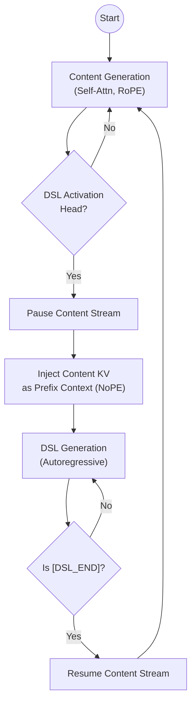

# Project MASA: Manifold-Aligned Sparse Attention

**Engineering Design Document v2.0 (Dual-Track LoRA Architecture)**

- **Date:** 2026-02-13
- **Status:** Detailed Design / Implementation Ready
- **Core Philosophy:** Dual-Track, Shared Base, Independent Positional Encoding, One-Way Dependency.

## 1. Vision & Research Roadmap

This project is not merely about building a sparse attention mechanism; it is about designing a curriculum for a model to learn how to manage its own long-term memory. We propose a progressive transition from explicit symbolic indexing to implicit latent representation.

### 1.1 The Core Hypothesis
An internalized "Memory Agent" (implemented via Dual-Track LoRA) can outperform external retrieval systems by learning to:
1.  **Actively Manage:** Decide *when* to create a memory index (DSL Activation).
2.  **Semantically Compress:** Learn compact representations of past contexts.
3.  **Soft-Address:** Use dense attention (NoPE) instead of hard kNN search.

### 1.2 The Three-Stage Evolution

We do not aim to build the final system in one shot. The DSL is a scaffold that will be gradually removed.

#### Stage A: The Scaffold (Symbolic & Explicit)
-   **Goal:** Validate the "Active Activation" mechanism.
-   **Method:**
    -   **DSL Content:** Explicit text summaries generated by an Oracle (e.g., GPT-4o).
    -   **Mechanism:** The model learns *when* to trigger `[DSL_START]` and *how* to attend to these text summaries.
    -   **Value:** Fully interpretable, easy to debug. Proves that an internal agent can manage memory better than a heuristic chunker.

#### Stage B: The Compression (Latent & Specific)
-   **Goal:** Increase information density and reduce context overhead.
-   **Method:**
    -   **DSL Content:** Distill text summaries into **Query Tokens** (Learned Embeddings).
    -   **Mechanism:** Each activation point is associated with a specific, learned embedding vector (growing table).
    -   **Value:** Efficiency. Validates if latent representations can retain recall quality comparable to explicit text.

#### Stage C: The Abstraction (Vocabulary & Compositional)
-   **Goal:** Achieve memory generalization and infinite capacity with finite vocabulary.
-   **Method:**
    -   **DSL Content:** Compositional codes from a fixed, abstract **Codebook**.
    -   **Mechanism:** "Peanut Allergy" is not a unique ID, but a combination of `[FOOD] + [RISK] + [USER_ATTR]`.
    -   **Value:** True generalization. The model learns the "morphemes" of memory.
    -   **Strategy:** We do not enforce this initially. We observe if Stage B's embeddings naturally cluster, then induce quantization/codebook formation via contrastive loss.

---

## 2. System Architecture Overview

The system implements a Dual-Track architecture where a single Foundation Model backbone is shared between two logical streams (Content & DSL).

### 2.1 The Two Tracks

**Track A: Content Stream (The "Host")**
- **Role:** Raw text generation, primary reasoning.
- **Parameters:** Frozen Base + LoRA_Content (optional/minimal).
- **KV Cache:** `content_kv` (Massive, sparsely loaded).
- **Positional Encoding:** Standard continuous RoPE.

**Track B: DSL Stream (The "Index")**
- **Role:** Semantic indexing, structural management.
- **Parameters:** Frozen Base + LoRA_DSL (Specialized for structure generation).
- **KV Cache:** `dsl_kv` (Compact, fully loaded).
- **Positional Encoding:** Independent RoPE for self-attention; NoPE (No Positional Encoding) for cross-attention.

## 3. Positional Encoding & KV Cache Design

This is the critical differentiator from standard architectures. We decouple the time-series of the content from the topology of the DSL.

### 3.1 Content Track

- **Position IDs:** $P_{content} \in \{0, 1, 2, ..., N\}$.
- **Strictly monotonic increasing.**
- The generation of DSL tokens does not increment the Content Position ID.
- **Example:** If "The spice" is pos 0, 1, and we generate 5 DSL tokens, "must flow" starts at pos 2, not 7.
- **KV Cache:** `content_kv` stores keys/values computed with $RoPE(P_{content})$.
- **Self-Attention:** Standard Causal Attention.

$$
A_{content} = \text{Softmax}\left(\frac{Q_c K_c^T}{\sqrt{d}} + M_{sparse}\right) V_c
$$

$M_{sparse}$ is determined by the MPN (see Section 5).

### 3.2 DSL Track

- **Position IDs:** $P_{dsl} \in \{0, 1, 2, ..., M\}$.
- **Independent monotonic counter.**
- Resets or continues depending on session policy (usually continuous for session history).
- **KV Cache:** `dsl_kv` stores keys/values computed with $RoPE(P_{dsl})$.

### 3.3 Cross-Track Attention (The "Semantic Bridge")

The DSL Track must attend to both its own history (to maintain syntax) and the Content (to understand semantics).

- **Query:** $Q_{dsl}$ (derived from DSL token with LoRA_DSL).
- **Key/Value Sources:**
    - `dsl_kv`: Using RoPE (Relative distance matters for DSL syntax).
    - `content_kv`: Using NoPE (No Positional Encoding).
- **Rationale:** The relative distance between a DSL token (pos 5) and a Content token (pos 1000) is physically meaningless. We rely purely on Semantic Matching.

**Attention Equation:**

$$
A_{dsl} = \text{Softmax}\left( [Q_{dsl}K_{dsl}^T \cdot \mathrm{RoPE\_Mask} \parallel Q_{dsl}K_{\mathrm{content\_raw}}^T] \right) \cdot [V_{dsl} \parallel V_{content}]
$$

> **Note:** $K_{content\_raw}$ refers to Key vectors before RoPE application, or we must inversely rotate Q to cancel RoPE for the cross-segment. (Engineering decision: likely easier to store non-RoPE keys for cross-attn or use a dedicated projection).

## 4. Execution Flow (The "Stop-and-Go" Runtime)

The system operates as a state machine switching between Content Mode and DSL Mode.



### 4.1 Step 1: Content Generation
- **State:** Active Track = Content. Adapter = LoRA_Content (or None).
- **Action:** Generate $W$ tokens (a chunk/segment) using standard causal self-attention.
- **Storage:** Accumulate `content_kv`.
- **Trigger:** Detect Stop Token (e.g., `\n`, `.`, or buffer full) OR `[DSL_START]` predicted by a lightweight head.

### 4.2 Step 2: Context Switch (The "Halt")
- **Action:**
    - Freeze Content generation.
    - Hot-Swap: Activate LoRA_DSL.
    - Define `Current_Content_Chunk = content_kv[Start_Ptr : End_Ptr]`.

### 4.3 Step 3: DSL Generation (Indexing)
- **State:** Active Track = DSL.
- **Action:** Autoregressive generation until `[DSL_END]` token.
- **Input:** `[DSL_START]`.
- **Context:** Can see all `dsl_kv` + `content_kv` (via NoPE Cross-Attn / Prefix Injection).
- **Storage:** Accumulate `dsl_kv`.

### 4.4 Step 4: Alignment & Mask Prediction
- **Action:**
    - **Registry Update:** Runtime records mapping: `New_DSL_Node_ID` $\rightarrow$ `Content_Range(Start_Ptr, End_Ptr)`.
    - **MPN Inference:**
        1. Take Hidden State of `[DSL_END]`.
        2. Compute scores against all historical DSL Nodes.
        3. **Gumbel Top-K:** Select Top-K relevant nodes.
    - **Mask Construction:**
        1. Convert selected Nodes to Content Ranges.
        2. Build binary/bias mask $M_{sparse}$ for the next content generation step.

### 4.5 Step 5: Resume Content
- **Action:**
    - **Hot-Swap:** Deactivate LoRA_DSL.
    - **Load:** Load selected `content_kv` pages into HBM (if paged out).
    - **Resume:** Continue Content generation. Position IDs continue from $W+1$.

## 5. Implementation Stages (Detailed)

### Stage A: DSL SFT (The Scaffold)
- **Goal:** Train LoRA_DSL to generate valid DSL tags based on content.
- **Data:** `(Raw_Text, DSL_Sequence)` pairs generated by Oracle (GPT-4o).
- **DSL Content:** Explicit Text Summaries.
- **Training:**
    - Freeze Base Model.
    - Train LoRA_DSL only.
    - **Loss:** NTP on DSL tokens only.
    - **Attention Mask:** DSL tokens attend to Content (NoPE) + DSL History (RoPE).

### Stage B: MPN Distillation & Compression
- **Goal:** Train the Mask Predictor to match Full Attention & Distill Summaries into Query Tokens.
- **Components:** Frozen Base + Frozen LoRA_DSL + Trainable MPN + **Trainable Query Embeddings**.
- **Procedure:**
    1. Run Content Stream with Full Attention (Teacher). Record Attention Map $A_{full}$.
    2. Run DSL Stream to get Node Embeddings.
    3. Train MPN to predict which historic Nodes cover the high-attention regions in $A_{full}$.
    4. **Compression:** Introduce an auxiliary loss to cluster similar DSL nodes, preparing for Stage C.
- **Loss:** $KL(A_{full} || A_{pred}) + L1_{sparsity} + L_{contrastive}$.

### Stage C: Abstraction (Future Work)
- **Goal:** Codebook Quantization.
- **Action:** Replace continuous Query Embeddings with a discrete Codebook.
- **Hypothesis:** If Stage B is successful, the embedding space will naturally form clusters representing "atomic concepts" of memory.

## 6. Critical Data Structures

### 6.1 Alignment Table (Runtime Registry)
The Runtime implicitly maintains pointers mapping DSL nodes to the Content stream. This is invisible to the LLM and handled entirely by the C++ backend.

#### Data Structure Design

```python
class DSLContentAlignment:
    segments: List[Segment]

class Segment:
    dsl_node_id: str          # e.g., "#D1"
    content_start: int        # content-only token index
    content_end: int          # content-only token index
    sequence_start: int       # absolute sequence position (content + DSL mixed)
    sequence_end: int         # absolute sequence position
```

#### Automatic Maintenance Logic

This alignment table is maintained automatically by the runtime based on token type (content vs DSL); the model is completely agnostic to its existence.

**Segmentation Logic at DSL Activation**

When `[DSL_START]` is generated, the runtime must determine the content range associated with this DSL node.

**Rule:** All content tokens between the previous `[DSL_END]` and the current `[DSL_START]` constitute the content range for the current DSL node.

```text
Time ----------------------------------------------------------------------->

Track A (Content):   [ Content Segment 1 ]          [ Content Segment 2 ]
                     ^                   ^          ^                   ^
                     |___________________|          |___________________|
                               |                              |
Track B (DSL):                 |         [DSL Block 1]        |         [DSL Block 2]
                               |         ^                    |         ^
                               |_________|                    |_________|
                               Suffix Binding                 Suffix Binding
```

The runtime tracks two state variables:
1. `content_token_count`: Global counter for content tokens.
2. `current_segment_start`: Starting content position of the current segment.

**Pseudocode:**

```python
content_token_count = 0      # Current segment's content token count
current_segment_start = 0    # Current segment's start content position

for token in generated_sequence:
    if token == [DSL_START]:
        # End of current content segment
        record_segment(start=current_segment_start,
                       end=content_token_count)
        # Enter DSL mode, pause content counting

    elif token == [DSL_END]:
        # DSL generation finished, new content segment starts
        current_segment_start = content_token_count
    elif is_content_token(token):
        content_token_count += 1
```

### 6.2 KV Cache Memory Layout
- **Pool A (Content):** Paged Memory. Pages can be evicted to CPU RAM. Indexed by `Content_Pos`.
- **Pool B (DSL):** Contiguous Memory (Ring Buffer). Always resident in HBM (High priority). Indexed by `DSL_Pos`.

## 7. Risk Analysis & Mitigation

- **Risk:** LoRA switching latency.
    - **Mitigation:** Use Multi-Head LoRA (merged weights with mask) instead of physical weight swapping. Both tracks' QKV projections exist simultaneously; we just route activation to the correct head.

- **Risk:** DSL Hallucination (generating IDs).
    - **Mitigation:** Strict Vocabulary constraints. DSL cannot generate numeric IDs. It only generates `[NODE]`, `[TYPE]`. Runtime assigns IDs.

- **Risk:** "NoPE" Attention collapse.
    - **Mitigation:** Ensure LoRA_DSL is sufficiently powerful to project Content Semantics into the DSL latent space effectively without needing positional cues.
