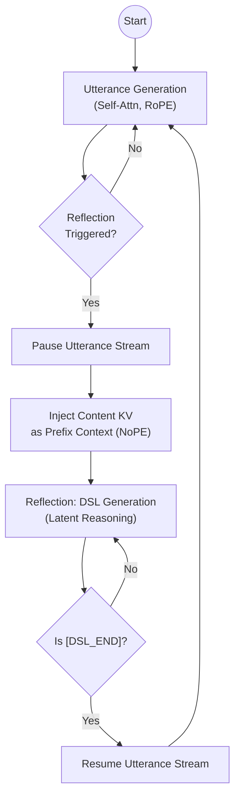

# Project MASA: Manifold-Aligned Sparse Attention

**Engineering Design Document v2.0 (Dual-Track LoRA Architecture)**

- **Date:** 2026-02-13
- **Status:** Detailed Design / Implementation Ready
- **Core Philosophy:** Dual-Track Latent Reasoning — a mutable thought stream that runs alongside an immutable utterance stream, enabling the model to actively construct, revise, and compose its own semantic memory.

## 1. Vision & Research Roadmap

> **What this project is NOT:** MASA is not an attempt to extend context windows or to compete with brute-force long-context architectures. Models with million-token windows already exist; making the context longer is a solved engineering problem. What remains unsolved is giving a model the ability to *think about* what it has experienced — to actively judge relevance, build cross-temporal connections, revise outdated beliefs, and reason over a structured internal representation of its own history.

This project designs a **latent reasoning track** that runs in parallel with the model's ordinary text generation. The text a model has already emitted is immutable — tokens, once spoken, cannot be unsaid. But the *ideas* those tokens rest upon can and should evolve. The DSL stream is where that evolution happens: a mutable, stack-managed thought substrate in which the model constructs, updates, and discards semantic memory nodes as its understanding develops.

We propose a progressive curriculum: start with an explicit symbolic scaffold (readable text summaries), compress it into learned latent representations, and ultimately arrive at a compositional codebook — the "morphemes of thought."

### 1.1 The Core Hypothesis
An internalized "Thought & Memory Agent" (implemented via Dual-Track LoRA) can develop structured reasoning capabilities that neither brute-force long context nor external retrieval can provide, by learning to:
1.  **Actively Construct:** Decide *when* a piece of content is worth crystallizing into a memory node, and generate that node in real time (DSL Activation as a deliberate cognitive act).
2.  **Establish Explicit Connections:** Build cross-temporal semantic links (RECALL, UPDATE, CONFLICT) that form an evolving graph of ideas — not merely a flat retrieval index, but a relational structure over the model's own history.
3.  **Revise and Forget:** Modify or discard memory nodes as understanding changes. The DSL stream is mutable by design — it is a *working memory*, not an append-only log.
4.  **Reason in Latent Space:** As the DSL evolves from text summaries (Stage A) to learned embeddings (Stage B) to compositional codes (Stage C), DSL generation itself becomes a form of latent reasoning — the model "thinks" in a compressed, non-verbal representation before deciding how to attend.

### 1.2 The Three-Stage Evolution

We do not aim to build the final system in one shot. The DSL begins as a human-readable scaffold and progressively internalizes into a true latent reasoning medium.

#### Stage A: The Scaffold (Symbolic & Explicit)
-   **Goal:** Validate the "Active Activation" mechanism — prove that the model can learn *when* and *why* to pause and reflect.
-   **Method:**
    -   **DSL Content:** Explicit text summaries generated by an Oracle (e.g., GPT-4o).
    -   **Mechanism:** The model learns *when* to trigger `[DSL_START]` and *how* to attend to these text summaries via NoPE cross-attention.
    -   **Value:** Fully interpretable, easy to debug. Establishes that a model can develop active memory management as a learned behavior, not a hard-coded heuristic.

#### Stage B: The Compression (Latent & Mutable)
-   **Goal:** (1) Transition the thought stream from text to latent space — DSL generation becomes non-verbal reasoning. (2) Enable mutable memory — introduce stack operations so the model can revise its own beliefs.
-   **Method:**
    -   **DSL Content:** Distill text summaries into **Query Tokens** (Learned Embeddings).
    -   **Mechanism:** Each activation point is associated with a specific, learned embedding vector. The model now "thinks" in latent codes rather than natural language.
    -   **Mutability:** Introduce `[PUSH]`, `[POP]`, `[UPDATE]` operations on the DSL KV buffer. Spoken words are immutable, but the thought nodes they are grounded in can be revised or discarded as the model's understanding evolves. This is the key architectural distinction: **the content stream is an append-only log; the DSL stream is a working memory.**
    -   **Value:** Validates that latent reasoning can maintain (or exceed) recall quality while providing true belief revision — something no flat context window can offer.

#### Stage C: The Abstraction (Vocabulary & Compositional)
-   **Goal:** Achieve compositional generalization — the model learns a finite set of "thought primitives" that combine to express open-ended concepts.
-   **Method:**
    -   **DSL Content:** Compositional codes from a fixed, abstract **Codebook**.
    -   **Mechanism:** "Peanut Allergy" is not a unique ID, but a combination of `[FOOD] + [RISK] + [USER_ATTR]`. The model has learned the "morphemes of thought."
    -   **Value:** True generalization with finite vocabulary. A new concept never seen in training can be expressed as a novel composition of existing codes — analogous to how humans form new ideas from familiar building blocks.
    -   **Strategy:** We do not enforce this initially. We observe if Stage B's embeddings naturally cluster, then induce quantization/codebook formation via contrastive loss.

---

## 2. System Architecture Overview

The system implements a Dual-Track architecture where a single Foundation Model backbone is shared between two logical streams: an immutable **Content** stream (what has been said) and a mutable **DSL** stream (what the model currently thinks about what has been said).

### 2.1 The Two Tracks

**Track A: Content Stream (The "Utterance")**
- **Role:** Surface-level text generation. This is the model's public output — once generated, immutable.
- **Parameters:** Frozen Base + LoRA_Content (optional/minimal).
- **KV Cache:** `content_kv` (Append-only, paged, sparsely loaded on demand).
- **Positional Encoding:** Standard continuous RoPE.

**Track B: DSL Stream (The "Thought")**
- **Role:** Latent reasoning, semantic connection-building, mutable belief management. This track is where the model reflects on content, establishes cross-temporal links, and revises its internal state.
- **Parameters:** Frozen Base + LoRA_DSL (Specialized for structured reasoning).
- **KV Cache:** `dsl_kv` (Compact, mutable, always resident — the model's working memory).
- **Positional Encoding:** Independent RoPE for self-attention; NoPE (No Positional Encoding) for cross-attention to Content.

## 3. DSL Design & Data Construction (Stage A)

The DSL is the scaffold for the model's thought stream in Stage A. It is designed to be simple, deterministic, and learnable — prioritizing Oracle consistency and model learnability over structural complexity. In later stages, the DSL's text content will be replaced by latent tokens, but the activation grammar (when to pause and think) persists throughout.

### 3.1 Design Constraints
1.  **Oracle-Side:** Must be simple enough for GPT-5/Gemini 3 Pro to generate high-quality labels in a few-shot setting without complex reasoning.
2.  **Learner-Side:** Target models (7B-13B) must learn to generate DSL at the correct timing via SFT. Token overhead must be minimal.
3.  **Runtime-Side:** Parsing must be deterministic (Regex/State Machine).

### 3.2 DSL Format
```text
[DSL_START] <activation_type> | <summary> [DSL_END]
```

#### 3.2.1 Activation Types
We define only four fundamental cognitive operations to maximize annotation consistency:

| Type | Description | MPN Behavior |
| :--- | :--- | :--- |
| **NEW** | A new entity, concept, fact, or preference worth remembering. No existing thought node. | No recall needed. Creates new thought node. |
| **RECALL** | The model recognizes a connection to a past thought. "This relates to something I noted before." | High attention to specific past thought nodes. Establishes explicit cross-temporal link. |
| **UPDATE** | A prior belief needs revision — information has changed, been corrected, or refined. | Locates past thought node; in Stage B+, overwrites it. In Stage A, creates a superseding node. |
| **CONFLICT** | Current content contradicts a prior belief. The model must hold both in tension. | High attention to conflicting thought node. Surfaces the contradiction for downstream reasoning. |

#### 3.2.2 Summary
-   **Role:** The primary carrier of the thought's content (Stage A only — replaced by latent tokens in Stage B+).
-   **Length:** 15-25 tokens.
-   **Style:** Free-text, written to maximize semantic discriminability for future cross-attention matching.
-   **Oracle Instruction:** *"Write a sentence such that if this information is needed in the future, using this sentence as a search query would find it."*
-   **No Explicit Pointers:** In `RECALL`, `UPDATE`, and `CONFLICT`, the summary text itself acts as a semantic pointer — the thought addresses past thoughts by meaning, not by ID.

**Examples:**
```text
[DSL_START] NEW | user is allergic to peanuts, carries epipen [DSL_END]
[DSL_START] RECALL | relates to user's earlier complaint about sleep quality [DSL_END]
[DSL_START] UPDATE | budget revised from $2000 to $3500 for kitchen renovation [DSL_END]
[DSL_START] CONFLICT | user previously said they prefer cats but now considering a dog [DSL_END]
```

### 3.3 Oracle Annotation Pipeline

#### Input Format
The Oracle receives the conversation history (segmented by turns) and the **Existing Memory Index**.

```text
CONVERSATION SO FAR:
[Turn 1] User: ...
[Turn 1] Assistant: ...

CURRENT SEGMENT (to be annotated):
[Turn 3] User: I actually changed my mind, let's go with the blue one.

EXISTING MEMORY INDEX:
1. NEW | user wants to redecorate living room
2. NEW | user prefers red color scheme, dislikes cold tones
```

#### Oracle Instructions
```text
Your task: Determine if the CURRENT SEGMENT triggers a memory activation.

Rules:
- Output NONE if the segment is purely transitional, phatic, or contains no memorable information.
- Output one DSL tag if activation is warranted.
- Type must be one of: NEW, RECALL, UPDATE, CONFLICT.
- Summary must be 10-25 tokens, written as a future search query.
- You may output multiple tags only if the segment contains clearly independent memory events (rare).

Output format:
[DSL_START] TYPE | summary text [DSL_END]
or
NONE
```

#### Data Construction & Quality Control
1.  **Generation:** Annotate large-scale multi-turn dialogue datasets using the Oracle pipeline.
2.  **Filtering:** Discard segments labeled `NONE`.
3.  **Formatting:** Construct training samples: `<content tokens> [DSL_START] TYPE | summary [DSL_END]`.
4.  **Consistency Check:** Use two distinct Oracles (e.g., GPT-5 and Gemini 3 Pro) to annotate the same data. Keep only samples where both agree on the `TYPE` and have high semantic similarity in `Summary`.

## 4. Positional Encoding & KV Cache Design

This is the critical differentiator from standard architectures. The Content stream lives in *sequential time* (token N follows token N-1). The DSL stream lives in *semantic space* (thought node M relates to thought node K by meaning, not by when they were created). We enforce this separation architecturally through independent positional encodings.

### 4.1 Content Track

- **Position IDs:** $P_{content} \in \{0, 1, 2, ..., N\}$.
- **Strictly monotonic increasing.**
- The generation of DSL tokens does not increment the Content Position ID.
- **Example:** If "The spice" is pos 0, 1, and we generate 5 DSL tokens, "must flow" starts at pos 2, not 7.
- **KV Cache:** `content_kv` stores keys/values computed with $RoPE(P_{content})$.
- **Self-Attention:** Standard Causal Attention.

$$
A_{content} = \text{Softmax}\left(\frac{Q_c K_c^T}{\sqrt{d}} + M_{sparse}\right) V_c
$$

$M_{sparse}$ is determined by the MPN (see Section 6).

### 4.2 DSL Track

- **Position IDs:** $P_{dsl} \in \{0, 1, 2, ..., M\}$.
- **Independent monotonic counter.**
- Resets or continues depending on session policy (usually continuous for session history).
- **KV Cache:** `dsl_kv` stores keys/values computed with $RoPE(P_{dsl})$.

### 4.3 Cross-Track Attention (The "Semantic Bridge")

When the thought stream attends to the utterance stream, positional distance is meaningless — a thought about "peanut allergy" should attend to the relevant utterance regardless of whether it was 10 or 10,000 tokens ago. This is not a long-context trick; it is the natural consequence of separating *when something was said* from *what it means*.

- **Query:** $Q_{dsl}$ (derived from DSL token with LoRA_DSL).
- **Key/Value Sources:**
    - `dsl_kv`: Using RoPE (Relative distance matters for DSL syntax coherence).
    - `content_kv`: Using NoPE (No Positional Encoding — pure semantic matching).
- **Rationale:** The thought stream addresses the content stream by *meaning*, not by *position*. This forces the model to develop genuine semantic retrieval as a learned internal capability, rather than relying on positional proximity as a cheap heuristic.

**Attention Equation:**

$$
A_{dsl} = \text{Softmax}\left( [Q_{dsl}K_{dsl}^T \cdot \mathrm{RoPE\_Mask} \parallel Q_{dsl}K_{\mathrm{content\_raw}}^T] \right) \cdot [V_{dsl} \parallel V_{content}]
$$

> **Note:** $K_{content\_raw}$ refers to Key vectors before RoPE application, or we must inversely rotate Q to cancel RoPE for the cross-segment. (Engineering decision: likely easier to store non-RoPE keys for cross-attn or use a dedicated projection).

## 5. Execution Flow (The "Pause-and-Reflect" Runtime)

The system operates as a state machine alternating between two cognitive modes: **Utterance** (generating text) and **Reflection** (reasoning about what was just said, updating the thought graph). This is analogous to how a careful speaker pauses mid-discourse to reconsider what they know before continuing.



### 5.1 Step 1: Utterance (Content Generation)
- **State:** Active Track = Content. Adapter = LoRA_Content (or None).
- **Action:** Generate $W$ tokens (a chunk/segment) using standard causal self-attention.
- **Storage:** Accumulate `content_kv`.
- **Trigger:** Detect Stop Token (e.g., `\n`, `.`, or buffer full) OR `[DSL_START]` predicted by a lightweight activation head — the model has decided it needs to pause and think.

### 5.2 Step 2: Pause (The "Halt")
- **Action:**
    - Freeze Content generation.
    - Hot-Swap: Activate LoRA_DSL (switch to reflection mode).
    - Define `Current_Content_Chunk = content_kv[Start_Ptr : End_Ptr]`.

### 5.3 Step 3: Reflection (DSL Generation — Latent Reasoning)
- **State:** Active Track = DSL.
- **Action:** Autoregressive generation until `[DSL_END]` token. In Stage A this produces readable text; in Stage B/C it produces latent tokens — the model is reasoning in a compressed, non-verbal representation.
- **Input:** `[DSL_START]`.
- **Context:** Can see all `dsl_kv` (the full thought history) + `content_kv` (via NoPE Cross-Attn / Prefix Injection).
- **Storage:** Accumulate `dsl_kv` — or, in Stage B+, potentially modify existing nodes via stack operations.

### 5.4 Step 4: Connection-Building & Mask Prediction
- **Action:**
    - **Registry Update:** Runtime records mapping: `New_DSL_Node_ID` $\rightarrow$ `Content_Range(Start_Ptr, End_Ptr)`.
    - **MPN Inference (Establishing Cross-Temporal Links):**
        1. Take Hidden State of `[DSL_END]` — the model's condensed "conclusion" from this reflection episode.
        2. Compute scores against all historical DSL Nodes — which past thoughts are relevant to the current one?
        3. **Gumbel Top-K:** Select Top-K relevant nodes. This is not retrieval; it is the model actively constructing a semantic link in its thought graph.
    - **Mask Construction:**
        1. Convert selected Nodes to Content Ranges.
        2. Build binary/bias mask $M_{sparse}$ for the next content generation step — the model's reflection determines what it "remembers" going forward.

### 5.5 Step 5: Resume Utterance
- **Action:**
    - **Hot-Swap:** Deactivate LoRA_DSL (return to utterance mode).
    - **Load:** Load selected `content_kv` pages into HBM (if paged out).
    - **Resume:** Continue Content generation. Position IDs continue from $W+1$. The model now generates with an attention mask shaped by its own reflective reasoning.

## 6. Implementation Stages (Detailed)

### Stage A: DSL SFT & Attention Distillation (The Scaffold)
- **Goal:** Train the model to (1) learn *when* to pause and reflect (active activation) and (2) produce interpretable thought nodes that correctly attend to relevant content.
- **Components:** Frozen Base + Trainable LoRA_DSL + Trainable MPN.
- **Data:** `(Raw_Text, DSL_Sequence)` pairs generated by Oracle (GPT-4o).
- **DSL Content:** Explicit Text Summaries (the scaffold — human-readable thoughts).
- **Step 1: DSL SFT (Learning to Reflect)**
    - Train LoRA_DSL to generate valid DSL tags and summaries based on content. The model learns the cognitive habit of pausing to crystallize understanding.
    - **Loss:** NTP on DSL tokens only.
- **Step 2: MPN Distillation (Learning to Connect)**
    - Train MPN to predict which thought nodes are semantically relevant to the current reflection — establishing cross-temporal links in the thought graph.
    - **Teacher Signal:** High-attention regions in Full Attention serve as ground truth for which connections the model *should* be making.
    - **Loss:** $KL(A_{full} || A_{pred}) + L1_{sparsity}$.

### Stage B: Latent Reasoning & Mutable Working Memory
- **Goal:** (1) Transition thoughts from natural language to latent space — DSL generation becomes non-verbal reasoning. (2) Enable mutable working memory via stack operations — the model can now revise what it believes, not just append new beliefs.
- **Components:** Frozen Base + Frozen LoRA_DSL + Trainable MPN + **Trainable Query Embeddings**.
- **DSL Content:** Hybrid (Text Summary → Latent Token Transition).
- **Step 1: Query Token Distillation (Internalizing Thought)**
    - Introduce learnable Query Tokens to replace text summaries. The model now "thinks" in a compressed code rather than in words.
    - **Loss:** Maintain Attention KL Divergence while minimizing the number of tokens used.
    - **Significance:** This is where the DSL stream ceases to be an index and becomes a genuine latent reasoning medium.
- **Step 2: Mutable Working Memory (The "Stack")**
    - Introduce DSL commands for belief revision: `[PUSH]`, `[POP]`, `[UPDATE]`.
    - Allow the model to modify the `dsl_kv` buffer — removing obsolete thought nodes, overwriting revised beliefs, compacting related nodes.
    - **Key Insight:** The content stream (what was said) is immutable. The thought stream (what those words mean, what the model currently believes) is mutable. This separation is the architectural core of MASA.
    - **Training:** RL or SFT on memory management traces.

### Stage C: Compositional Thought Vocabulary (Future Work)
- **Goal:** Achieve compositional generalization — a finite vocabulary of "thought primitives" that combine to express unbounded concepts.
- **DSL Content:** Compositional Codes from a fixed Codebook.
- **Action:**
    - Replace continuous Query Embeddings with a discrete Codebook.
    - Observe if the embedding space naturally forms clusters representing "atomic concepts" of thought.
    - If so, this is evidence that the model has learned a *language of thought* — distinct from natural language, optimized for internal reasoning and memory management.

## 7. Critical Data Structures

### 7.1 Alignment Table (Runtime Registry)
The Runtime implicitly maintains pointers mapping thought nodes (DSL) to the utterance segments (Content) they reflect upon. This bookkeeping is invisible to the LLM and handled entirely by the C++ backend.

#### Data Structure Design

```python
class DSLContentAlignment:
    segments: List[Segment]

class Segment:
    dsl_node_id: str          # e.g., "#D1"
    content_start: int        # content-only token index
    content_end: int          # content-only token index
    sequence_start: int       # absolute sequence position (content + DSL mixed)
    sequence_end: int         # absolute sequence position
```

#### Automatic Maintenance Logic

This alignment table is maintained automatically by the runtime based on token type (content vs DSL); the model is completely agnostic to its existence.

**Segmentation Logic at DSL Activation**

When `[DSL_START]` is generated, the runtime must determine the content range associated with this DSL node.

**Rule:** All content tokens between the previous `[DSL_END]` and the current `[DSL_START]` constitute the content range for the current DSL node.

```text
Time ----------------------------------------------------------------------->

Utterance Stream:    [ Content Segment 1 ]          [ Content Segment 2 ]
                     ^                   ^          ^                   ^
                     |___________________|          |___________________|
                               |                              |
Thought Stream:                |      [Reflection 1]          |      [Reflection 2]
                               |         ^                    |         ^
                               |_________|                    |_________|
                               Suffix Binding                 Suffix Binding
```

The runtime tracks two state variables:
1. `content_token_count`: Global counter for content tokens.
2. `current_segment_start`: Starting content position of the current segment.

**Pseudocode:**

```python
content_token_count = 0      # Current segment's content token count
current_segment_start = 0    # Current segment's start content position

for token in generated_sequence:
    if token == [DSL_START]:
        # End of current content segment
        record_segment(start=current_segment_start,
                       end=content_token_count)
        # Enter DSL mode, pause content counting

    elif token == [DSL_END]:
        # DSL generation finished, new content segment starts
        current_segment_start = content_token_count
    elif is_content_token(token):
        content_token_count += 1
```

### 7.2 KV Cache Memory Layout
- **Pool A (Content — Immutable Utterance Log):** Paged Memory. Pages can be evicted to CPU RAM and loaded on demand. Indexed by `Content_Pos`.
- **Pool B (DSL — Mutable Working Memory):** Contiguous Memory (Ring Buffer). Always resident in HBM (high priority) because this is the model's active thought state. Indexed by `DSL_Pos`. In Stage B+, nodes can be pushed, popped, or overwritten.

## 8. Risk Analysis & Mitigation

- **Risk:** LoRA switching latency (utterance ↔ reflection transitions).
    - **Mitigation:** Use Multi-Head LoRA (merged weights with mask) instead of physical weight swapping. Both tracks' QKV projections exist simultaneously; we just route activation to the correct head.

- **Risk:** DSL Hallucination (generating IDs or spurious structure).
    - **Mitigation:** Strict Vocabulary constraints. DSL cannot generate numeric IDs. It only generates `[NODE]`, `[TYPE]`. Runtime assigns IDs. In Stage B+, the latent token vocabulary is fixed and learned, further constraining the output space.

- **Risk:** "NoPE" Attention collapse (thought stream fails to ground in content).
    - **Mitigation:** Ensure LoRA_DSL is sufficiently powerful to project Content Semantics into the thought-stream latent space effectively without needing positional cues. Monitor cross-attention entropy during training; if it collapses, introduce auxiliary contrastive loss on thought-content pairs.

- **Risk:** Misinterpretation of project scope — readers may confuse MASA with a long-context solution.
    - **Mitigation:** This document explicitly states (Section 1) that MASA is not about extending context windows. The sparse attention mask is a *consequence* of the model's reflective reasoning, not the primary objective. The primary objective is a mutable, structured thought stream that enables active memory management and latent reasoning.
